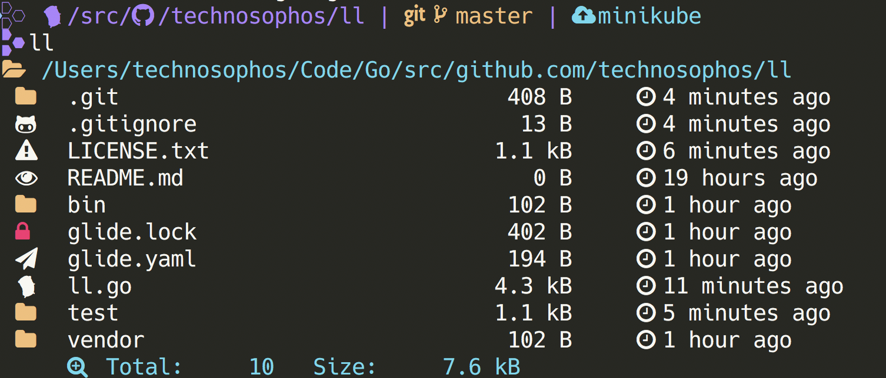

# ll: Long Lister

This is a developer-oriented replacement for `ls -lh`.

It uses unassigned Unicode code points to differentiate between different file
types. And if you so happen to use [Nerd Fonts](https://github.com/ryanoasis/nerd-fonts),
the result is awesome. In all other cases, it's likely just ugly.

With iTerm2 (macOS) and the Nerd Font called "Knack Regular Nerd Font Complete",
`ll`'s output looks like this:



## To install:

Prerequisites:
- Rust & Cargo
- One of the [Nerd Fonts](https://www.nerdfonts.com/) (look in Homebrew)

You can install particular Nerd Fonts fonts [with these instructions](https://github.com/ryanoasis/nerd-fonts#option-4-homebrew-fonts)

Grab this repo and build:

```console
$ git clone $THIS_REPO
$ cd $THIS_REPO
$ cargo install --path . 
```

## Troubleshooting

- You definitely need to install nerd-fonts and configure your terminal to use
  one of the Nerd Fonts fonts, or else this will be really ugly.
- Some shells alias `ll` to `ls -lah`. You may need to add `unalias ll`
  or `alias ll=$(which ll)`

=====

This project is mainly for my own edification. You're more than welcome to submit
PRs or even fork this and create a version that [scratches your own itch](http://www.catb.org/~esr/writings/cathedral-bazaar/cathedral-bazaar/ar01s02.html).

Yes, this project used to be in Go. After Go 1.13's release, I decided I was no
longer interested in keeping my projects in Go.